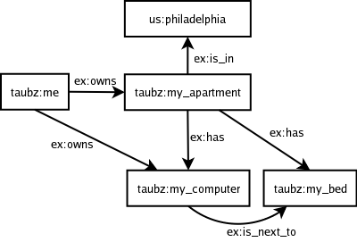
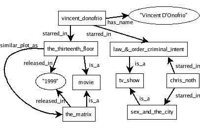

# What is RDF and what is it good for?

Joshua Tauberer

Last revised January 2008

This is an introduction to RDF (“Resource Description 
Framework”), which is the standard for encoding metadata and other knowledge on
the Semantic Web. In the Semantic Web, computer applications make use of
structured information spread in a distributed and decentralized way throughout
the current web.  RDF is an abstract model, a way to break down knowledge
into discrete pieces, and while it is most popularly known for its RDF/XML
syntax, RDF can be stored in a variety of formats. This article discusses
the abstract RDF model, two concrete serialization formats, how RDF is used
and how it differs from plain XML, higher-level RDF semantics, best practices
for deployment, and querying RDF data sources.

* * *

Translations

The first chapter (Really Quick Introduction) has been translated into:

* [Russian](http://xmlhack.ru/texts/06/rdf-quickintro/rdf-quickintro.html) by A.Skrobov
* [Spanish](http://www.seofreelance.es/que-es-rdf-introduccion-a-rdf/) by Ricard Menor

* * *

0.  [Really Quick Introduction](#Quick Intro)
1.  [Why we need a new standard for the Semantic Web](#Why we need a new standard for the Semantic Web)
2.  [Introducing RDF](#Introducing RDF)
3.  [Triples of knowledge](#Triples of knowledge)
    1.  [The abstract RDF model: Statements](#Statements)
    2.  [URIs to Name Resources](#URIs to Name Resources)
    3.  [Wrapping It Up So Far](#Wrapping It Up So Far)
    4.  [Blank Nodes and Literal Values](#Blank Nodes and Literal Values)
4.  [Reading and Writing RDF](#Reading and Writing RDF)
    1.  [Notation 3](#Notation 3)
    2.  [RDF/XML](#RDF/XML)
    3.  [Use a Validator!](#Use a Validator!)
5.  [Distributed Information](#Distributed Information)
    1.  [Choosing the Right Predicates](#Choosing the Right Predicates)
    2.  [Meshing Information: A Real-World Example](#Meshing Information)
6.  [Comparing RDF with XML](#Comparing RDF with XML)
7.  [RDF about RDF](#RDF about RDF)
    1.  [RDF Schema (RDFS)](#RDF Schema)
    2.  [Web Ontology Language (OWL)](#Web Ontology Language)
8.  [Linked Data for the Web](#Linked Data for the Web)
    1.  [Terminology](#Terminology)
    2.  [Linked Data Under the Hood](#Linked Data Under the Hood)
9.  [Querying Semantic Web Databases](#Querying Semantic Web Databases)
10.  [Closing Remarks](#Closing Remarks)<Changes>

This document was originally written in October 2005.
In July 2006 it was revised and extended with material
from my [xml.com](http://www.xml.com/pub/a/2001/01/24/rdf.html)
article "What is RDF". In January 2008 it was revised
with more on N3 and RDF/XML and extended with the new sections Linked Data for the Web and
Querying Semantic Web Databases

## Really Quick Intro to RDF

This section is a really brief introduction to Resource Description Framework (RDF). You might also be interested
in...

*   My more in-depth guide, which you'll find after this quick part wraps up.
*   Two video introductions to [the Semantic Web](http://wiki.digitalbazaar.com/en/Semantic-web-intro) and [RDF and RDFa](http://wiki.digitalbazaar.com/en/Rdfa-basics) by Manu Sporny are very good.
*   Ian Davis's [RDF Tutorial](http://research.talis.com/2005/rdf-intro/) slides are also very good.

RDF is a method for expressing knowledge in a decentralized world and 
is the foundation of the Semantic Web, in which computer applications 
make use of distributed, structured information spread throughout the 
Web.  Just to get it out of the way, RDF isn't strictly an XML format, 
it's not just about metadata, it has little to do with RSS, and it's not 
as complicated as you think.

### The Big Picture

RDF is a general method to decompose any type of knowledge into small pieces, with some rules about the semantics, or 
meaning, of those pieces. The point is to have a method so simple that it can express any fact, and yet so 
structured that computer applications can do useful things with it.  Here's some RDF:

<pre class="code">
@prefix : &lt;http://www.example.org/&gt; .
:john    a           :Person .
:john    :hasMother  :susan .
:john    :hasFather  :richard .
:richard :hasBrother :luke .
</pre>

The meaning is obvious.  We'll get to the details later.

If you know XML, here's a brief comparison.  Like RDF, XML also is designed to be simple and 
general-purpose. XML can be abstracted beyond its written brackets-and-slashes notation to something more 
abstract, a "DOM" for tree-structured data.  Similarly, RDF isn't just about how you write it.  It's about 
representing network- or graph-structured information.  You _can_ write RDF in XML, and many
people do.  Here's what it might look like:

<pre class="code">
&lt;rdf:RDF xmlns:rdf="http://www.w3.org/1999/02/22-rdf-syntax-ns#"
	xmlns:ns="http://www.example.org/#"&gt;
  &lt;ns:Person rdf:about="http://www.example.org/#john"&gt;
    &lt;ns:hasMother rdf:resource="http://www.example.org/#susan" /&gt;
    &lt;ns:hasFather&gt;
      &lt;rdf:Description rdf:about="http://www.example.org/#richard"&gt;
        &lt;ns:hasBrother rdf:resource="http://www.example.org/#luke" /&gt;
      &lt;/rdf:Description&gt;
    &lt;/ns:hasFather&gt;
  &lt;/ns:Person&gt;
&lt;/rdf:RDF&gt;
</pre>

But you don't have to use XML.  I don't.  The first format above, called N3, is just as good.

What really sets RDF apart from XML and other things is that RDF is designed 
to represent knowledge in a distributed world.  This means RDF is
particularly concerned with meaning. Everything at all mentioned in RDF means something, whether a reference 
to something concrete in the world, an abstract concept, or a fact.  Standards built on RDF
describe logical inferences between facts and how to search for facts in a large database of RDF knowledge.

What makes RDF suited for distributed knowledge is that RDF applications can
put together RDF files posted by different people around the Internet and easily learn from them new things 
that no single document asserted. It does this in two ways, first by linking documents together by the common 
vocabularies they use, and second by allowing any document to use any vocabulary.  This flexibility is fairly
unique to RDF.

Consider this second document of RDF:

<pre class="code">
@prefix : &lt;http://www.example.org/&gt; .
:richard :hasSister :rebecca
{ ?a :hasFather ?b . ?b :hasSister ?c . } =&gt; { ?a :hasAunt ?c } .
</pre>

This RDF document defines what it means to be an aunt, in terms of two other relations.
You could imagine an application putting this document together with the first RDF document to determine
that <tt>:rebecca</tt> is <tt>:john</tt>'s aunt.  What makes this work is that the names of entities
are global.  That is, when <tt>:john</tt> and <tt>:hasFather</tt> are used in one document, applications can assume
they have the same meaning in any other RDF document with the same <tt>@prefix</tt>.

So why use RDF?  Here are use cases, as described by Richard Cyganiak
on the [W3C's Semantic Web mail list](http://www.w3.org/2001/sw/interest/):

*   You want to integrate data from different sources without custom programming.
*   You want to offer your data for re-use by other parties*   You want to decentralize data in a way that no single party "owns" all the data.
*   You want to do something fancy with large amounts of data (browse,
	query, match, input, extract, ...), so you develop (or re-use) a generic
	tool that allows you to do this on top of the RDF data model (which has
	the advantage of not being tied to a proprietary data
	storage/representation technology, like a database dialect).

### RDF Defined

RDF can be defined in three simple rules:

1.  A fact is expressed as a triple of the form (Subject, Predicate, Object).  It's like a little English sentence.
2.  Subjects, predicates, and objects are names for entities, whether concrete or abstract, in the real world.
Names are either 1) global and refer to the same entity in any RDF document in which they appear, or
2) local, and the entity it refers to cannot be directly refered to outside of the RDF document.
3.  Objects can also be text values, called literal values.

You've seen facts already.  Each line below was a fact:

<pre class="code">
:john    a           :Person .
:john    :hasMother  :susan .
  ...
</pre>

Names come in two types.  Global names, which have the same meaning everywhere, are always Uniform 
Resource Identifiers (URIs).  URIs can have the same syntax or format as website addresses, so you will see 
RDF files that contain URIs like <tt>http://www.w3.org/1999/02/22-rdf-syntax-ns#type</tt>, where that URI is 
the global name for some entity. The fact that it looks like a web address is totally incidental. There may or 
may not be an actual website at that address, and it doesn't matter. There are other types of URIs besides 
http:-type URIs. URNs are a subtype of URI used for things like identifying books by their ISBN number, e.g.  
<tt>urn:isbn:0143034650</tt>. TAGs are a general-purpose type of URI. They look like 
<tt>tag:govtrack.us,2005:congress/senators/frist</tt>. URIs are used as global names because they provide a 
way to break down the space of all possible names into units that have obvious owners. URIs that start with 
<tt>http://www.rdfabout.net/</tt> are implicitly controlled by me.

This point is important and needs repeating: Whatever their form, URIs you see in RDF documents are merely 
verbose names for entities, nothing more.  Forget that it has anything to do with the web.

Since URIs can be quite long, in various RDF notations they're usually abbreviated using the concept of 
namespaces from XML.  That's what the colons are doing in <tt>:john</tt>, <tt>:hasMother</tt>, and the
other entities in the example.  The colons indicate the name is an abbreviated form.  In these
cases, the names were <tt>http://www.example.org/#john</tt>, <tt>http://www.example.org/#hasMother</tt>, etc.

When written out, URIs are generally enclosed in brackets to distinguish them from namespaced-abbreviated names.

Literal values allow text to be included in RDF.  This is used heavily when RDF is used for metadata:

<pre class="code">
&lt;http://www.rdfabout.net/&gt; a :Website .
&lt;http://www.rdfabout.net/&gt; dc:title "rdf:about" .
&lt;http://www.rdfabout.net/&gt; dc:description "A website about
	Resource Description Framework." .
</pre>

And that's basically RDF.

### RDF As A Graph

There are two complementary ways of looking at RDF information. The first is as a set of statements, like above. Each statement represents a fact. The second way is as a graph.

A graph is basically a network. Graphs consist of nodes interconnected by edges. In the Internet, for instance, the nodes are the computers, and the edges are the ethernet wires connecting them. In RDF, the nodes are names (not actual entities) and the edges are statements. Here's an example:

Each arrow or edge is a RDF statement. The name at the start of the arrow is the statement's subject, the name at the end of the arrow is the statement's object, and the name that labels the arrow is the predicate.
RDF as a graph expresses exactly the same information as RDF written out as triples, but the graph form makes it easier for us humans to see structure in the data.

### A Quick Example

So how is RDF useful?  It's the technology for the job when you want to mesh together distributed 
information.

Here's a scenario where distributed information makes a lot of sense: a database of products from multiple 
vendors and reviews of those products from multiple reviewers. No one vendor is going to want to be 
responsible for maintaining a central database for this project, especially since it will contain information 
for competing products and negative reviews. Likewise, no one reviewer may have the resources to keep such a 
database up to date.

RDF is particularly suited for this project. Each vendor and reviewer will publish a file in RDF on their 
own websites. The vendors will choose URIs for their products, and the reviewers will use those URIs when 
composing their reviews. Vendors don't need to agree on a common naming scheme for products, and reviewers 
aren't tied to a vendor-controlled data format. RDF allows the vendors and reviewers to agree on what they 
need to agree on, without forcing anyone to use one particular vocabulary.

Here are the RDF files they publish:

<pre class="code">
**Vendor 1:**
vendor1:productX	dc:title	"Cool-O-Matic" .
vendor1:productX	retail:price	"$50.75" .
vendor1:productX	vendor1:partno	"TTK583" .
vendor1:productY	dc:title	"Fluffertron" .
vendor1:productY	retail:price	"$26.50" .
vendor1:productY	vendor1:partno	"AAL132" .

**Vendor 2:**
vendor2:product1	dc:title	"Can Closer" .
vendor2:product2	dc:title	"Dust Unbuster" .

**Reviewer 1:**
vendor1:productX	dc:description	"This product is good buy!" .

**Reviewer 2:**
vendor2:product2  dc:description  "Who needs something to unbust dust? 
                                  A dust buster would be a better idea,
                                  and I wish they posted the price." .
vendor2:product2  review:rating   review:Excellent .
</pre>                                  

It's an open question just how an application will retrieve these files, but I'll put that aside. Once an 
application has these files, it has enough information to relate products to reviews to prices, and even to 
vendor-specific information like vendor1:partno. What you should take away from this 
example is how unconstraining RDF is, while still allowing applications to immediately be able to relate 
information together.

The vendors and reviewers didn't have to agree on much to make this happen. They had to agree to use RDF, 
but they didn't have to agree on any specific data format or even on specific URIs.  Crucially, they 
didn't have to enumerate everything any vendor would want to include about their products, and they
can't lock out reviewers from posting related information.

Another way to look at this from the standpoint of interoperability. Vendor 1's format is entirely 
interoperable with anyone else's format, even though Vendor 1 didn't hash out a common format with anyone. 
When someone comes along and wants to be interoperable with Vendor 1's information, they don't need a new 
format, they just need to choose the right subjects, predicates, and objects.

### Conclusion

If you thought RDF was complicated, I hope you see now that it
doesn't have to be.  RDF is easy to write, flexible, and unconstraining.
It makes it easy to model knowledge and to mesh distributed knowledge sources.

## Why we need a new standard for the Semantic Web

On the [Semantic Web](http://www.w3.org/2001/sw/), computers do the browsing for us.  The “SemWeb” enables computers to seek out knowledge distributed throughout the Web, mesh it, and then take action based on it.  To use an analogy, the current Web is a decentralized platform for distributed _presentations_ while the SemWeb is a decentralized platform for distributed _knowledge_.  [RDF](http://www.w3.org/RDF/) is the W3C standard for encoding knowledge.

There of course is knowledge on the current Web, but it's off limits to computers.  Consider a [Wikipedia](http://www.wikipedia.org) page, which might convey a lot of information to the human reader, but to the computer displaying the page all it sees is presentation markup.  To the extent that computers make sense of HTML, images, Flash, etc., it's almost always for the purpose of creating a presentation for the end-user.   The real content, the knowledge the files are conveying to the human, is opaque to the computer.

What is meant by “[semantic](http://en.wikipedia.org/wiki/Semantics)” in the Semantic Web is not that computers are going to understand the meaning of anything, but that the logical pieces of meaning can be mechanically manipulated by a machine to useful ends.

So now imagine a new Web where the real content can be manipulated by computers.  For now, picture it as a web of databases.  One “semantic” website publishes a database about a product line, with products and descriptions, while another publishes a database of product reviews.  A third site for a retailer publishes a database of products in stock.  What standards would make it easier to write an application to mesh distributed databases together, so that a computer could use the three data sources together to help an end-user make better purchasing decisions?

There's nothing stopping anyone from writing a program now to do those sorts of things, in just the same way that nothing stopped anyone from exchanging data before we had XML.  But standards facilitate building applications, especially in a decentralized system.  Here are some of the things we would want a standard about _distributed knowledge_ to consider:

1.  Files on the Semantic Web need to be able to express information flexibly.  Life can't be neatly packed into tables, as in relational databases, or hierarchies, as in XML.  The information about movies and TV shows contained in the graph below is really best expressed _as a graph_:

	

_Knowledge as a Graph_

Of course, we can't be drawing our way through the Semantic Web, so instead we will need a tabular notation for these graphs. Compare the table below to the figure above. Each row represents an arrow (an “edge”) in the figure. The first column has the name of the “node” at the start of the edge. The second column has the label of the edge itself (the kind of edge). The third column has the name of the node at the end of the arrow.

<table border="1">
	<tr><th>Start Node</th> <th>Edge Label</th> <th>End Node</th></tr>
	<tr><td>vincent_donofrio</td> <td>starred_in</td> <td>law_&amp;_order_ci</td></tr>
	<tr><td>law_&amp;_order_ci</td> <td>is_a</td> <td>tv_show</td> </tr>
	<tr><td>the_thirteenth_floor</td> <td>similar_plot_as</td> <td>the_matrix</td> </tr>
	<tr><td colspan="3">...</td></tr>
</table>

Whether we represent the graph as a picture or in a table, we're talking about the same thing. Both describe what is abstractly called a graph. More on this later.

2.  Files on the Semantic Web need to be able to relate to each other.  A file about product prices posted by a vendor and a file with product reviews posted independently by a consumer need to have a way of indicating that they are talking about the same products.  Just using product names isn't enough.  Two products might exist in the world both called “The Super Duper 3000,” and we want to eliminate ambiguity from the SemWeb so that computers can process the information with certainty.  The SemWeb needs globally unique identifiers that can be assigned in a decentralized way.

3.  We will use vocabularies for making assertions about things, but these vocabularies must be able to be mixed together.  A vocabulary about TV shows developed by TV aficionados and a vocabulary about movies independently developed by movie connoisseurs must be able to be used together in the same file, to talk about the same things, for instance to assert that an actor has appeared in both TV shows and movies.

These are some of the requirements that RDF, Resource Description Framework, provides a standard for, as we'll see in the next section.  Before getting too abstract, here are actual RDF examples of the information from the graph above, first in the Notation 3 format, which closely follows the tabular encoding of the underlying graph:

_Notation 3 Example_
<pre>
@prefix rdf: &lt;http://www.w3.org/1999/02/22-rdf-syntax-ns#&gt; .
@prefix ex: &lt;http://www.example.org/&gt; .

ex:vincent_donofrio ex:starred_in ex:law_and_order_ci .
ex:law_and_order_ci rdf:type ex:tv_show .
ex:the_thirteenth_floor ex:similar_plot_as ex:the_matrix .
</pre>

And in the standard RDF/XML format, which may have a more intuitive feel and is more explicit about hierarchical structure in the graph, but in most cases it tends to obscure the underlying graph:

_RDF/XML Example_
<pre>
&lt;rdf:RDF xmlns:rdf="http://www.w3.org/1999/02/22-rdf-syntax-ns#"
    xmlns:ex="http://www.example.org/"&gt;

    &lt;rdf:Description rdf:about="http://www.example.org/vincent_donofrio"&gt;
        &lt;ex:starred_in&gt;
            &lt;ex:tv_show rdf:about="http://www.example.org/law_and_order_ci" /&gt;
        &lt;/ex:starred_in&gt;
    &lt;/rdf:Description&gt;

    &lt;rdf:Description rdf:about="http://www.example.org/the_thirteenth_floor"&gt;
        &lt;ex:similar_plot_as rdf:resource="http://www.example.org/the_matrix" /&gt;
    &lt;/rdf:Description&gt;

&lt;/rdf:RDF&gt;
</pre>

RDF was [originally](http://www.w3.org/TR/1999/REC-rdf-syntax-19990222/) created in 1999 as a standard on top of XML for encoding metadata — literally, data about data.  Metadata is of course things like who authored a Web page, what date a blog entry was published, etc., information that is in some sense _secondary_ to some other content already on the regular Web.  Since then, and perhaps even after [the updated RDF spec in 2004](http://www.w3.org/TR/rdf-primer/), the scope of RDF has really evolved into something greater.  The most exiting uses of RDF aren't in encoding information about Web resources, but information about and relations between things in the real world: people, places, concepts, etc.

## Introducing RDF

Unless you know Resource Description Framework (RDF) well, it's 
probably best if you try to forget what you already know about it as you
read the rest of this section.  RDF 
exists at the intersection of a few different technologies, so it's easy 
to be lead into thinking that it is merely a particular XML data format or a 
tool for blog feeds.  Forget what you know.  Here is RDF from the 
beginning.

RDF is a general method to decompose knowledge into small pieces, with some
rules about the semantics, or meaning, of those pieces. The 
point is to have a method so simple that it can express any fact, and 
yet so structured that computer applications can do useful things with knowledge 
expressed in RDF. I say "method" in particular, rather than format, because one 
can write down those pieces in any number of ways and still preserve the 
original information and structure, just like how one can express the same meaning in 
different human languages or implement the same data structure in
multiple ways.

In some ways, RDF can be compared to XML.  XML also is designed to be 
simple and applicable to any type of data.  XML is also more than a file 
format. It is a foundation for dealing with hierarchical, self-contained
documents, whether they be stored on disk in the usual brackets-and-slashes format, 
or held in memory and accessed through a DOM API.

What sets RDF apart from XML is that RDF is designed to represent 
_knowledge_ in a _distributed_ world. That RDF is designed for 
knowledge, and not data, means RDF is particularly concerned with 
meaning.  Everything at all mentioned in RDF means something.  It may be 
a reference to something in the world, like a person or movie, or it may 
be an abstract concept, like the state of being friends with someone 
else.  And by putting three such entities together, the RDF standard says 
how to arrive at a fact.  The meaning of the triple “(John, Bob, the state of being 
friends)” might be that John and Bob are friends.  By putting a lot of facts 
together, one arrives at some form of knowledge.  Standards built on top of
RDF, including RDFS and OWL, add to RDF semantics for drawing logical
inferences from data.

For comparison, XML itself is not very much concerned with meaning.
XML nodes don't need to be associated with particular concepts, and
the XML standard doesn't indicate how to derive a fact from a document.
For instance, if you were presented with a few XML documents whose root nodes
were in a foreign language you don't understand, you couldn't do anything
useful with the documents but display them.  RDF documents with nodes
you can't understand could still actually be usefully processed because RDF specifies
some basic level of meaning.  Now, this isn't to say that you couldn't
develop your own standard on top of XML that says how to derive
the set of facts in an XML document, but you'll find you've probably
just reinvented something like RDF.

The second key aspect of RDF is that it works well for distributed
information.  That is, RDF applications can put together RDF files
posted by different people around the Internet and easily learn from them new
things that no single document asserted.  It does this in two ways,
first by linking documents together by the common vocabularies they use,
and second by allowing any document to use any vocabulary.  This allows
enormous flexibility in expressing facts about a wide range of things,
drawing on information from a wide range of sources.

> For the official documentation on RDF, start with the [RDF Primer](http://www.w3.org/TR/rdf-primer/).

## Triples of knowledge

RDF provides a general, flexible method to decompose any knowledge into small pieces, called triples, with some rules about the semantics (meaning) of those pieces.

The foundation is breaking knowledge down into basically what's called a labeled, directed graph, if you know the terminology.

Each edge in the graph represents a fact, or a relation between two things.  The edge in the figure above from the node <tt>vincent_donofrio</tt> labeled <tt>starred_in</tt> to the node <tt>the_thirteenth_floor</tt> represents the fact that actor Vincent D'Onofrio starred in the movie “The Thirteenth Floor.”  A fact represented this way has three parts: a subject, a predicate (i.e. verb), and an object.  The subject is what's at the start of the edge, the predicate is the type of edge (its label), and the object is what's at the end of the edge.

The six documents composing [the RDF specification](http://www.w3.org/TR/rdf-primer/) tell us two things.  First, it outlines [the abstract model](http://www.w3.org/TR/2004/REC-rdf-concepts-20040210/), i.e. how to use triples to represent knowledge about the world.  Second, it describes [how to encode those triples in XML](http://www.w3.org/TR/rdf-syntax-grammar/). We'll take each subject in turn.

### The abstract RDF model: Statements

RDF is nothing more than a general method to decompose information into 
pieces.  The emphasis is on general here because the same method can be 
used for any type of information.  And the method is this: **Express 
information as a list of statements in the form SUBJECT PREDICATE 
OBJECT.**  The _subject_ and _object_ are names for two things in the world, 
and the _predicate_ is the name of a relation between the two.  You can 
think of predicates as verbs.

Here's how I would break down information about my apartment into RDF 
statements:

<table style="text-align: center">
<tr><th>SUBJECT</th> <th>PREDICATE</th> <th>OBJECT</th></tr>
<tr><td>I</td> <td>own</td> <td>my_apartment</td></tr>
<tr><td>my_apartment</td> <td>has</td> <td>my_computer</td></tr>
<tr><td>my_apartment</td> <td>has</td> <td>my_bed</td></tr>
<tr><td>my_apartment</td> <td>is_in</td> <td>Philadelphia</td></tr>
</table>

These four lines express four facts.  Each line is called a **statement**
or **triple**.

The subjects, predicates, and objects in RDF are always simple
names for things: concrete things, like _my_apartment_, or abstract concepts,
like _has_.  These names don't have internal structure or significance
of their own.  They're like proper names or variables.  It doesn't matter
what name you choose for anything, as long as you use it consistently
throughout.

Names in RDF statements are said to **refer to** or **denote** things in
the world.  The things that names denote are called **resources** (dating back
to RDF's use for metadata for web resources),
**nodes** (from graph terminology), or **entities**.  These terms are
generally all synonymous. For instance, the name
_my_apartment_ denotes my actual apartment, which is an entity in the
real world.  The distinction between names and the entities they denote
is minute but important because two names can be used to refer to the
same entity.

Predicates are always relations between two things.  _Own_ is a 
relation between an owner and an 'ownee'; _has_ is a relation between the 
container and the thing contained; _is_in_ is the inverse relation, 
between the contained and the container.  In RDF, the order of the subject
and object is very important.

The next aspect of RDF almost goes without saying, but I want to put 
everything down in print: **If someone refers to something as X in one place 
and X is used in another place, the two X's refer to the same entity.**
When I wrote _my_apartment_ in the first line, it's the 
same apartment that I meant when I wrote it in the other three 
lines.

The rules so far already get us a lot farther than you might realize.  Given this 
table of statements, I can write a simple program that can answer 
questions like "who own my_apartment" and "my_apartment has what."  The 
question itself is in the form of an RDF statement, except the program 
will consider wh-words like who and what to be wild-cards.  A simple question-answering 
program can compare the question to each row in the table.  Each 
matching row is an answer.  Here's the pseudocode:

_Pseudocode for Question-Answering_
<pre>
question = (my_apartment, has, what)
knowledge = (
		(I, own, my_apartment),
		(my_apartment, has, my_computer),
		(my_apartment, has, my_bed),
		(my_apartment, is_in, Philadelphia)
	)
for each statement in knowledge {
	if ((statement.subject == question.subject
			or question.subject == what) {
		  and (statement.predicate == question.predicate
		  	or question.predicate == what)
		  and (statement.object == question.object
		    or question.object == what))
		call FoundAnswer(statement)
	}
}

Output:
	Answer: my_apartment has my_computer
	Answer: my_apartment has my_bed
</pre>

The computer doesn't need to know what _has_ actually means in English for 
this to be useful.  That is, it's left up to the application writer to 
choose appropriate names for things (e.g. my_apartment) and to use the 
right predicates (own, has).  RDF tools are ignorant of what these names 
mean, but they can still usefully process the information.  (I'll get to 
more useful things later.)

### URIs to Name Resources

RDF is meant to be published on the Internet, and so the 
names I used above have a problem.  I shouldn't name something 
my_apartment because someone else might use the name my_apartment for 
their apartment too.  Following from the last fact about RDF, RDF tools 
would think the two instances of my_apartment referred to the same thing 
in the real world, whereas in fact they were intended to refer to two 
different apartments.  The last aspect of RDF is that names must be 
global, in the sense that you must not choose a name that someone else 
might conceivably also use to refer to something different.  Formally, 
**names for subjects, predicates, and objects must be Uniform Resource 
Identifiers (URIs)**. (Technically, names can be Internationalized
Resource Identifiers (IRIs) but the distinction is not important.)

URIs can have the same syntax or format as website addresses, so you will 
see RDF files that contain URIs like <tt>http://www.w3.org/1999/02/22-rdf-syntax-ns#type</tt>, where that URI is the 
global name for some entity. This happens to be the URI for the concept
of "is a" (if you recognize it).

Now, in the SemWeb world, URIs are treated in a somewhat inconsistent
way, so bear with me here. On the one hand, URIs are supposed to be opaque.
The fact that a URI looks like a web address is totally 
incidental.  There may or may not be an actual website at that address, 
and it doesn't matter.  There are other types of URIs besides <tt>http:</tt>-type
URIs.  URNs are a subtype of URI used for things like identifying books
by their ISBN number, e.g. <tt>urn:isbn:0143034650</tt>.  [TAGs](http://www.taguri.org/07/draft-kindberg-tag-uri-07.html) are a general-purpose
type of URI.  They look like <tt>tag:govtrack.us,2005:congress/senators/frist</tt>.
Not all URIs name web pages. That's the difference between a URI and a URL.
URLs are just those URIs that name things on the web that can be retrieved, aka "**dereferenced**".

So the convention goes: whatever their form, URIs you see in RDF 
documents are merely verbose names for entities, nothing more.
Well, at least, that's how people felt about URIs till around 2007.

Starting in recent years there actually _has_ been an expectation
that if you create an <tt>http:</tt> URI — or, any dereferencable
URI (a URL) — that you actually put something at that address so that RDF
clients can access that page and get some information. Here's the bottom
line: As for what a URI _means_ in a document, what the URI is
simply doesn't matter, but when you use dereferencable URIs, there
may be an expectation that you put something on the web at that address.
We will return to this in the section about Linked Data.

URIs are used as global names because they provide a way to break down 
the space of all possible names into units that have obvious owners.  
URIs that start with <tt>http://www.govtrack.us/</tt> are implicitly controlled 
by me, or whoever is running the website at that address.  By 
convention, if there's an obvious owner for a URI, no one but that owner 
will "mint" a new resource with that URI.  This prevents name clashes.  
If you create a URI in the space of URIs that you control, you can rest 
assured no one will use the same URI to denote something else.
(Of course, someone might use your URIs in a way that you would not
appreciate, but this is a subject for another article.)

Since URIs can be quite long, in various RDF notations they're 
usually abbreviated using the concept of namespaces from XML.  As in 
XML, a namespace is generally declared at the top of an RDF document and 
then used in abbreviated form later on.  Let's say I've declared the 
abbreviation <tt>taubz</tt> for the URI <tt>http://razor.occams.info/index.html#</tt>.  
In many RDF notations, I can then abbreviate URIs like 
<tt>http://razor.occams.info/index.html#my_apartment</tt> by replacing the namespace 
URI exactly as it is given in the declaration with the abbreviation and 
a colon, in this case simply as <tt>taubz:my_apartment</tt>. The precise 
rules for namespacing depend on the RDF serialization syntax being 
used.

Importantly, namespaces have no significant status in RDF. They are merely
a tool to abbreviate long URIs.

I might re-write the table about my apartment as it is below, replacing 
the simple names I first used above with abritrary URIs:

_RDF about My Apartment_
<pre>
Let taubz: abbreviate http://razor.occams.info/index.html#

taubz:me            http://example.org/own    taubz:my_apartment
taubz:my_apartment  http://example.org/has    taubz:my_computer
taubz:my_apartment  http://example.org/has    taubz:my_bed
taubz:my_apartment  http://example.org/is_in  http://example.org/Philadelphia
</pre>

The table above is just an informal table representing the graph
of information that exists at an abstract level, which could just
as well be described by the figure below. We will talk more
about standard ways of actually _writing out_ RDF later on.

_RDF as a Graph_

### Wrapping It Up So Far

And that's RDF.  Everything else in the Semantic Web builds on those
three rules, repeated here to hammer home the simplicity of the system:

1.  A fact is expressed as a triple of the form (Subject, Predicate, Object).
2.  Subjects, predicates, and objects are given as names for entities, whether
	concrete or abstract, in the real world.
3.  Names are in the format of URIs, which are opaque and global.

These concepts form most of the abstract RDF model for encoding knowledge.  It's analogous to the common API that most XML libraries provide.  If it weren't for us curious humans always peeking into files, the actual format of XML wouldn't matter so much as long as we had our <tt>appendChild</tt>, <tt>setAttribute</tt>, etc.  Of course, we do need a common file format for exchanging data, and in fact there are two for RDF, which we look at later.

### Blank Nodes and Literal Values

There is actually a bit more to RDF than the three rules above. So 
far I've described three types of things in RDF: resources (things or 
concepts) that exist in the real world, global names for resources (i.e. URIs), and 
RDF statements (triples, or rows in a table).  There are two more things.

#### Literals

The first new thing is the **literal value**.  Literal values
are raw text that can be used instead of objects in RDF triples.
Unlike names (i.e. URIs) which are stand-ins for things in the real world,
literal values are just raw text data inserted into the graph.
Literal values could be used to relate people to their names,
books to their ISBN numbers, etc.:

_Some Uses of Literals_
<pre>
taubz:me          foaf:name  "Joshua Ian Tauberer"
book:HarryPotter  dc:title   "Harry Potter"
book:HarryPotter  ex:price   "$18.75"
</pre>

#### Blank/Anonymous Nodes

Then there are **anonymous nodes**, **blank nodes**, or
**bnodes**. These terms are all synonymous. The words anonymous or blank are meant to indicate
that these are nodes in a graph without a name, either because the
author of the document doesn't know or doesn't want to or need to provide a name.
In a sense, this is like saying “John is friends with _someone_, but
I'm not telling who.” When we say these nodes are nameless, keep in mind two
things. First, the real-world thing that the node denotes is not inherently
nameless. John's friend, in the example, has a name, after all. Second,
when we say nameless here, we are refering to the concept of naming things
with URIs. Actual blank nodes in documents may be given “local” identifiers
so that they may be referred to multiple times within a document. It is
only that these local identifiers are explicitly not global, and have no
meaning outside of the document in which they occur.

If you're familiar with formal semantics, blank nodes can often be thought
of as existentially bound variables.

Here's one way literal values and anonymous nodes are used. One literal
value in the example is <tt>"Joshua Tauberer"</tt>, and the anonymous
or blank node is <tt>_:anon123</tt>.

_Blank Nodes and Literal Values_
<pre>
taubz:me               foaf:name    "Joshua Tauberer"
taubz:me               ex:has_read  &lt;urn:isbn:0143034650&gt;
&lt;urn:isbn:0143034650&gt;  dc:title     "Free Culture : The Nature and Future of Creativity"
&lt;urn:isbn:0143034650&gt;  dc:author    _:anon123
_:anon123              foaf:name    "Lawrence Lessig"
</pre>

To distinguish between URIs, namespaced names (abbreviated URIs),
anonymous nodes, and literal values, I used the following common convention:

*   Full URIs are enclosed in angle brackets.
*   Namespaced names are written plainly, but their colons give them away.
*   Anonymous nodes are written like namespaced names, but in the reserved "_" namespace with an arbitrary local name after the colon.
*   Literal values are enclosed in quotation marks.

You should take a moment to try to visualize what graph is described by the
table. Picture arrows between nodes.

There is one blank node in this example, <tt>_:anon123</tt>.  What we know
about this resource is that it is the author of <tt>&lt;urn:isbn:0143034650&gt;</tt>
and it has the name _Lawrence Lessig_.  Because no global name is used
for this resource, we can't really be sure who we're talking about here. And,
if we wanted to say more about whatever is denoted by <tt>_:anon123</tt>, 
we would have to do it in this very RDF document because we would have no 
way to refer to this particular Lawrence Lessig outside of the document.

#### More on Literals: Language Tags and Datatypes

Literal values can be optionally adorned with one of two pieces
of metadata. The first is a _language tag_, to specify what language
the raw text is written in. The language tag should be viewed as
a vestige of how RDF was used in the early days. Today it is an
ugly hack. You may see “ "chat"@en ”, the literal value
“chat” with an English language tag, or “ "chat"@fr ”,
the same with the French language tag.

Alternatively, a literal value can be tagged with a URI indicating a _datatype_.
The datatype indicates how to interpret the raw text, such as as a number,
a URI, a date or time, etc. Datatypes can be any URI, although the datatypes
defined in [XML Schema](http://www.w3.org/TR/xmlschema-2/) are used by convention.
The notation for datatypes is often the literal value in quotes followed
by two carets, followed by the datatype URI (possibly abbreviated):

_Datatypes_
<pre>
"1234"                This is an untyped literal value. No datatype.
"1234"^^xsd:integer   This is a typed literal value using a namespace.
"1234"^^&lt;http://www.w3.org/2001/XMLSchema#integer&gt;   The same with the full datatype URI.
</pre>

Datatypes are a bit tricky. Let's think of the datatype for floating-point numbers.
At an abstract level, the floating-point numbers themselves are different from the _text_
we use to represent them on paper. For instance, the text “5.1” represents
the number 5.1, but so does “5.1000” and “05.10”. Here there
are multiple textual representations — what are called lexical representations —
for the same _value_. A datatype tells us how to map lexical representations
to values, and vice versa.

The semantics of RDF takes language tags and datatypes into account.
This means two things. First, a literal value without either a language
tag or datatype is different from a literal with a language tag is different
from a literal with a datatype. These four statements say four different
things and none can be inferred from the others:

_Literal Semantics_
<pre>
#john foaf:name "John Jones"              John's name is a lanaguage-less,
                                          datatype-less raw text value.
#john foaf:name "John Jones"@en           John's name, in English, is John Jones.
#john foaf:name "Jacque Jones"@fr         John's name, in French, is Jacque Jones.
#john foaf:name "John Jones"^^xsd:string  John's name is a _string_.
</pre>

So, an untyped literal with or without a language tag is _not the same_ as a typed literal.
The second part of the semantics of literals is that two typed literals
that appear different _may be the same_ if their datatype maps their
lexical representations to the same value. The following statements _are_
equivalent (at least for an RDF application that has been given the
semantics of the XSD datatypes):

_Datatype Semantics_
<pre>
#john ex:age "10"^^xsd:float
#john ex:age "10.000"^^xsd:float
</pre>

These mean John's age is 10. That is, the textual representation of the
number is besides the point and is not part of the meaning encoded by
the triples. Note that if the float datatype were not specified, the
triples would not be inherently equivalent, and the textual representation
of the 10 would be maintained as part of the information content.

#### More on Blank Nodes: Some Caveats

Unlike the rule for URIs stating that they are global, local identifiers
used to name blank nodes are explicitly _not_ global. A local bnode
identifier used in two separate documents can refer to two things. Still,
however, the identifier itself is arbitrary, and the actual identifier
used in any particular case is not a part of the information content of
the document.

Anonymous nodes are often used to avoid having to assign
people URIs, as in the example above.  They're also often used in representing more complex relations:

_Blank Nodes for Complex Relations_
<pre>
taubz:me   ex:hasName     _:anon234
_:anon234  ex:firstName   "Joshua"
_:anon234  ex:middleName  "Ian"
_:anon234  ex:lastName    "Tauberer"
</pre>

Here the anonymous node was used as an intermediate step in the 
relation between me and the parts of my name.  The node represents my 
name in a structured way, rather than using a single opaque literal value
"Joshua Ian Tauberer".  RDF only allows binary relations, so it's 
necessary to express many-way relations using intermediate nodes, and
these nodes are often anonymous.

## Reading and Writing RDF

In this section, we describe two standard ways of writing out RDF.
	Because RDF is the abstract graph-like model, we call these
	written formats serialization syntaxes for RDF.

	

### Notation 3

[Notation 3](http://www.w3.org/DesignIssues/Notation3.html) (“N3”), or the subset called [Turtle](http://www.dajobe.org/2004/01/turtle/), is a de facto standard for writing out RDF.
	It is not a W3C standard, but it is widely deployed, commonly used in email discussions between
	SemWeb developers, and the most important RDF notation to understand because it most clearly
	captures the abstract graph.

Here is an example, and it should be mostly clear what _triples_ are encoded
	by this document.

_Notation 3 Example_
<pre>
@prefix dc: &lt;http://purl.org/dc/elements/1.1/&gt; .
@prefix geo: &lt;http://www.w3.org/2003/01/geo/wgs84_pos#&gt; .
@prefix edu: &lt;http://www.example.org/&gt; .

&lt;http://www.princeton.edu&gt; geo:lat "40.35" ; geo:long "-74.66" .
&lt;http://www.cs.princeton.edu&gt; dc:title "Department of Computer Science" .
&lt;http://www.princeton.edu&gt; edu:hasDept &lt;http://www.cs.princeton.edu&gt; .
</pre>

In tabular form (actually also a standard called NTriples), this is:

_Tabular or NTriples Form_
<pre>
&lt;http://www.princeton.edu&gt; &lt;http://www.w3.org/2003/01/geo/wgs84_pos#lat&gt; "40.35" .
&lt;http://www.princeton.edu&gt; &lt;http://www.w3.org/2003/01/geo/wgs84_pos#long&gt; "-74.66" .
&lt;http://www.cs.princeton.edu&gt; &lt;http://purl.org/dc/elements/1.1/title&gt; "Department of..." .
&lt;http://www.princeton.edu&gt; &lt;http://www.example.org/hasDept&gt; &lt;http://www.cs.princeton.edu&gt; .
</pre>

This is meant to express the geographic latitude and longitude coordinates of Princeton University,
that it has a department, and that that department is named "Department of Computer Science".

In N3 and Turtle, statements are just written out as the subject URI (in brackets or abbreviated with 
namespaces), followed by the predicate URI, followed by the object URI or literal value, followed by a period.  
Also, namespaces are declared at the top with the <tt>@prefix</tt> directive.  Full URIs are reassembled
from the abbreviated notation, like <tt>geo:lat</tt>, just by concatenating the corresponding
namespace with the second part of the abbreviation, i.e. <tt>http://www.w3.org/2003/01/geo/wgs84_pos#</tt>
+ <tt>lat</tt> = <tt>http://www.w3.org/2003/01/geo/wgs84_pos#lat</tt>.

N3 has some syntactic sugar that allows further abbreviations.  If
many statements repeat the same subject and predicate, just separate
the objects with commas:

_N3 Syntactic Sugar: Commas_
<pre>
&lt;http://www.princeton.edu&gt; edu:hasDept &lt;http://www.cs.princeton.edu&gt; ,
	&lt;http://www.math.princeton.edu&gt; , &lt;http://history.princeton.edu&gt; .
</pre>

And if the same subject is repeated, but with different predicates,
one may use semicolons as in the example:

_N3 Syntactic Sugar: Semicolons_
<pre>
&lt;http://www.princeton.edu&gt; geo:lat "40.35" ; geo:long "-74.66" .
</pre>

N3 has a few other abbreviations as well.  The common predicate
<tt>rdf:type</tt> can be abbreviated simply as the letter <tt>a</tt> (as in "is a").

Further, blank nodes are represented in N3 in two ways. In the first way,
they are given local names in the reserved underscore “_“ prefix:

_Blank Nodes in Notation 3 - Method One_
<pre>
&lt;http://www.princeton.edu&gt; edu:hasDept _:deptOne, _:deptTwo .
_:deptOne dc:title "Department of Computer Science" .
_:deptTwo dc:title "Department of Psychology" .
</pre>

The second way uses square brackets, and is recursive. Square brackets
represent a blank node, and inside the brackets you can put predicate-object pairs
separated by semicolons to encode properties of that blank node. For example:

_Blank Nodes in Notation 3 - Method Two_
<pre>
&lt;http://www.princeton.edu&gt; edu:hasDept 
    [ dc:title "Department of Computer Science" ] ,
    [ dc:title "Department of Psychology" ].
</pre>

The two blank node N3 examples encode precisely the same information
as in the previous example.
Keep in mind that it's not the form of the N3 document that ever matters.
Whether someone uses commas, semicolons, brackets, or underscores is always besides the point. What matters
is what triples are encoded by the document.

> You should read the [Primer using N3](http://www.w3.org/2000/10/swap/Primer.html)
> 	for more examples.

	

### RDF/XML

The W3C specifications define an [XML format](http://www.w3.org/TR/rdf-syntax-grammar/) to encode RDF.
	Since it works under the same abstract model as Notation 3, the differences between the formats are superficial — readability.

The same information in the first N3 example above looks like this in RDF/XML:

_RDF/XML Example_
<pre>
&lt;rdf:RDF xmlns:rdf="http://www.w3.org/1999/02/22-rdf-syntax-ns#"
    xmlns:dc="http://purl.org/dc/elements/1.1/"
    xmlns:geo="http://www. w3.org/2003/01/geo/wgs84_pos#"
    xmlns:edu="http://www.example.org/"&gt;

    &lt;rdf:Description rdf:about="http://www.princeton.edu"&gt;
        &lt;geo:lat&gt;40.35&lt;/geo:lat&gt;
        &lt;geo:long&gt;-74.66&lt;/geo:long&gt;
        &lt;edu:hasDept rdf:resource="http://www.cs.princeton.edu"/&gt;
    &lt;/rdf:Description&gt;

    &lt;rdf:Description rdf:about="http://www.cs.princeton.edu"&gt;
        &lt;dc:title&gt;Department of Computer Science&lt;/dc:title&gt;
    &lt;/rdf:Description&gt;

&lt;/rdf:RDF&gt;
</pre>

The questions you should be asking yourself are: What are the standardized rules for interpreting the nodes and attributes in this document as an abstract RDF graph, and what are the standardized rules for producing a document in this form given an abstract RDF graph?

In an RDF/XML document there are two types of XML nodes: 1) resource XML nodes and 2) property XML nodes.  Resource XML nodes are the subjects and objects of statements, and they usually are <tt>rdf:Description</tt> tags that have an <tt>rdf:about</tt> attribute on them giving the URI of the resource they represent.  In this example, the <tt>rdf:Description</tt> nodes are the resource nodes.

Resource XML nodes contain within them property XML nodes (and nothing else). Each property XML node represents a single statement. The subject of the statement is the outer resource XML node that contains the property. There are four statements in this example, the first three with the subject <tt>http://www.princeton.edu</tt> and the fourth with the subject <tt>http://www.cs.princeton.edu</tt>. The URIs of the predicates in the four statements are (abbreviated) <tt>geo:lat</tt>, <tt>geo:long</tt>, <tt>edu:hasDept</tt>, and <tt>dc:title</tt>.

Statements can have either resources or literal values as their objects, as discussed earlier in this article.
	To put a literal value as the object of a property XML node, the value simply goes inside the XML element. See how "40.35" and "-74.66" are used above.

Using a resource as an object can be done in two ways. The first way is illustrated in the example, by using a <tt>rdf:resource</tt> attribute in which you put the URI of the object. You can describe properties of that object elsewhere, as is done above in a separate <tt>rdf:Description</tt> resource XML node at the top-level of the document.

The second way is to tuck the <tt>rdf:Description</tt> element right inside the property XML node and leave off <tt>rdf:resource</tt>. The example above is equivalently written as:

_RDF/XML Example Alternative_
<pre>
...
&lt;rdf:Description rdf:about="http://www.princeton.edu"&gt;
    &lt;geo:lat&gt;40.35&lt;/geo:lat&gt;
    &lt;geo:long&gt;-74.66&lt;/geo:long&gt;
    &lt;edu:hasDept&gt;
        &lt;rdf:Description rdf:about="http://www.cs.princeton.edu"&gt;
            &lt;dc:title&gt;Department of Computer Science&lt;/dc:title&gt;
        &lt;/rdf:Description&gt;
    &lt;/edu:hasDept&gt;
&lt;/rdf:Description&gt;
...
</pre>

From the specification we are told how to take the XML document above and get out of it this table of statements. You can check that you understand the format by comparing this
	document with the first N3 example and the explanation in the previous section. The two documents
	encode exactly the same triples.

We'll discuss just one syntactic shortcut here because it is
	so commonly used. Consider this example:

_RDF/XML Example With Types_
<pre>
&lt;rdf:RDF xmlns:rdf="http://www.w3.org/1999/02/22-rdf-syntax-ns#"
    xmlns:ex="http://www.example.org/"&gt;

    &lt;rdf:Description rdf:about="http://www.princeton.edu"&gt;
        &lt;rdf:type rdf:resource="http://www.example.org/University"/&gt;
    &lt;/rdf:Description&gt;
&lt;/rdf:RDF&gt;
</pre>

This example contains just a single triple. The <tt>rdf:type</tt> 
	predicate is used to say what type of thing a resource is. Here, the 
	point is to say that the resource denoted by 
	<tt>http://www.princeton.edu</tt> is a university. Because <tt>rdf:type</tt>
	is so common, rather than creating a property XML node for it, it
	can be abbreviated by replacing the <tt>rdf:Description</tt> tag
	with the type:

_RDF/XML Example With Types - Abbreviated_
<pre>
&lt;rdf:RDF xmlns:rdf="http://www.w3.org/1999/02/22-rdf-syntax-ns#"
    xmlns:ex="http://www.example.org/"&gt;

    &lt;ex:University rdf:about="http://www.princeton.edu"&gt;
    &lt;/ex:University&gt;
&lt;/rdf:RDF&gt;
</pre>

These two documents are completely equivalent. So, when something
	other than <tt>rdf:Description</tt> is the name of a resource XML
	node, then there is a <tt>rdf:type</tt> triple encoded.
	<tt>rdf:Description</tt> is not itself a type. It is a syntactic placeholder. It does not
	translate into a triple.

It is possible to use blank nodes in RDF/XML as well, and there are
	many syntactic shortcuts that you will see commonly used. 
	You will have to
	consult the specifications to see these things, as it's time we move on.

### Use a Validator!

Triples are the bread and butter of RDF.  When applications use RDF in XML or N3 format, they see the triples. The hierarchical structure of the XML and the order of the XML nodes is lost in the table of triples, which means that, like whitespace, it was not a part of the information meant to be encoded in the RDF.
	With XML and N3, the particular syntactic or formatting choices are always besides the point.
	Make sure you understand the triples encoded in any document!

When in doubt, you can use an online validator to convert RDF in one
	format to another more triple-oriented format. Converting RDF/XML to
	N3 or, better yet, N-Triples is a good way to get a clear view of
	what triples are encoded by the XML.

The W3C maintains a [RDF validator](http://www.w3.org/RDF/Validator/)
	which converts an RDF document that you paste into a text box into a table
	of RDF triples. This is good also to check your RDF syntax.

There is also a [validator on this site](/demo/validator)
	which can convert back and forth between N3 and RDF/XML. You can use
	this to check your RDF/XML or N3 syntax, and to double-check what
	triples are encoded in N3 documents.

> See also: The authoratative definitions of [N3 
> syntax](http://www.w3.org/2000/10/swap/Primer.html) and [RDF/XML syntax](http://www.w3.org/TR/rdf-syntax-grammar/).

## Distributed Information

So far, RDF might seem unnecessarily complex.  For all of the examples
so far, the information could be written in plain XML just the same.
Taking a single document in isolation,
this is true.  But RDF excels when every document is thought
of as part of the bigger picture, part of a huge graph of
knowledge spread throughout the Internet.  In this "Semantic
Web," every RDF statement posted somewhere on the net contributes
a small piece to the greater body of knowledge.

But, not every piece of knowledge in the Semantic Web is
automatically interpretable.  Applications have to be told what
to do with particular predicates, or else the RDF is just URI salad.
In the next section, I tackle this further.

### Choosing the Right Predicates

As you've seen so far, one can use RDF to model any type of knowledge
without having to use any centrally approved notions.  If no one
has coined a URI for something you want to describe, you can create 
your own URI for it.  This goes for not just subjects and objects but 
predicates as well.  In the examples above, I made up all of the URIs, 
and it's still perfectly valid RDF.

The trouble is that if I make up all of my own URIs, my RDF document
has no meaning to anyone else unless I explain what each URI is intended
to denote or mean. Two RDF documents with no URIs in common have no information 
that can be interrelated.  But, two documents that have some URIs in 
common are talking about some of the same things.  Someone else might 
want to publish information about Law &amp; Order.  By using the same URI for
the television show in the two documents, RDF tools will be able to recognize
that the two documents are describing the same thing.

Here is an example of using RDF to describe books.  Let's say, 
hypothetically, that the Library of Congress posted an RDF list of books 
and Amazon.com did the same.

_RDF from the Library of Congress (hypothetical)_
<pre>
&lt;urn:isbn:0143034650&gt;  dc:title  "Free Culture : The Nature and Future of Creativity"
&lt;urn:isbn:0613917472&gt;  dc:title  "Code and Other Laws of Cyberspace"
&lt;urn:isbn:B00005U7WO&gt;  dc:title  "The Future of Ideas"
</pre>

_RDF from Amazon.com (hypothetical)_
<pre>
&lt;urn:isbn:0143034650&gt;  amazon:price  "$15.00" .
&lt;urn:isbn:0613917472&gt;  amazon:price  "$26.35" .
&lt;urn:isbn:B00005U7WO&gt;  amazon:price  "$9.95" .
</pre>

The URIs for the books (<tt>urn:isbn:...</tt>) 
are what tie the two files together.  An RDF application using these 
files would be able to report that "The Future of Ideas" is "$9.95" at 
Amazon because both the title and the price are related to a common 
resource, denoted by the URI <tt>urn:isbn:B00005U7WO</tt>.  If the files did not 
have the same URI for that book, nothing would indicate that the titles 
went with particular prices.

It's also important to use the same predicates others are using when 
the predicates you want already exist.  This allows existing 
applications to make use of your information, without needing to be 
modified by developers to recognize your own URIs. For instance, if you're 
describing documents, you should use the existing [Dublin Core (DC)](http://dublincore.org/documents/dces/) title and 
description predicates so RDF applications that already use those 
predicates will be able to extract the titles and descriptions from your 
data.  If you're describing people, use existing [Friend of a Friend (FOAF)](http://www.foaf-project.org/) predicates so that 
FOAF-based applications will be able to take advantage of the 
information.

I used <tt>dc:title</tt> in my books example above because the predicate already 
existed to convey the information I wanted to put into the files: a 
relation between a book and its title.  No standard predicate exists for 
giving the Amazon.com price of a book, so I made one up.  (Remember 
<tt>amazon:price</tt> is an abbreviated form of a full URI, but I've left out the 
declaration of <tt>amazon:</tt> for the sake of brevity.)

Be careful of respecting the meanings of existing predicates, though.  
RDF applications expect the <tt>dc:title</tt> predicate to relate a document to 
its title.  You wouldn't want to use it to relate a telephone to its 
phone number, for instance, because existing RDF applications that get
a hold of your data will use it in ways that simply won't make sense.

### Meshing Information: A Real-World Example

Most of the time in today's world you get information from one place.  
For instance, a single database might contain the information for an 
entire product line.  There isn't much on the web in the way of 
distributed information because it's usually hard to put information 
together from multiple sources, each of which may have its own data 
format and conventions.

Here's a scenario where distributed information makes a lot of sense: a 
database of products from multiple vendors and reviews of those products 
from multiple reviewers.  No one vendor is going to want to be 
responsible for maintaining a central database for this project, 
especially since it will contain information for competing products and 
negative reviews.  Likewise, no one reviewer may have the resources to 
keep such a database up to date.  How can this become a reality?

RDF is particularly suited for this project.  Each vendor and reviewer 
will publish a file in RDF on their own websites.  The vendors will 
choose URIs for their products, and the reviewers will use those URIs 
when composing their reviews.  Vendors don't need to agree on a common 
naming scheme for products, and reviewers aren't tied to a 
vendor-controlled data format.  RDF allows the vendors and reviewers to 
agree on what they need to agree on, without forcing anyone to use one 
particular vocabulary.

_Vendor 1_
<pre>
vendor1:productX	dc:title	"Cool-O-Matic"
vendor1:productX	retail:price	"$50.75"
vendor1:productX	vendor1:partno	"TTK583"
vendor1:productY	dc:title	"Fluffertron"
vendor1:productY	retail:price	"$26.50"
vendor1:productY	vendor1:partno	"AAL132"
</pre>

_Vendor 2_
<pre>
vendor2:product1	dc:title	"Can Closer"
vendor2:product1	retail:price	"$28.11"
vendor2:product1	vendor2:warranty_code	"None."
vendor2:product2	dc:title	"Dust Unbuster"
vendor2:product2	retail:price	"$33.21"
vendor2:product2	vendor2:warranty_code	"X12"
</pre>

_Reviewer 1_
<pre>
vendor1:productX	dc:description	"This product is good buy!" .
</pre>

_Reviewer 2_
<pre>
vendor2:product2  dc:description  "Who needs something to unbust dust? 
                                  A dust buster would be a better idea."
vendor2:product2  review:rating   review:Excellent
</pre>

It's an open question just how an application will retrieve these files, 
but I'll put that aside.  Once an application has these files, it has 
enough information to relate products to reviews to prices, and even to 
vendor-specific information like <tt>vendor1:partno</tt> and 
<tt>vendor2:warranty_code</tt>.  What you should take away from this example is 
how unconstraining RDF is, while still allowing applications to 
immediately be able to relate information together.

And, RDF applications don't need to know about the nature of the data in 
these files to be able to make use of it.  If an application already knows what 
the <tt>dc:title</tt> and <tt>dc:description</tt> predicates are for,
and nothing else, then it is at least able to present the titles and 
reviews of the four products.  Note that the presence of predicates
the application doesn't understand, like <tt>review:rating</tt>, doesn't
impact the application at all.  It can simply ignore it without worrying
that it has misunderstood the rest of the data.

In addition, the vendors and reviewers did not have to agree on much to 
make this happen.  They had to agree to use RDF, but they didn't have to 
agree on any specific data format or even on specific URIs.  It helps 
that they agreed on URIs for indicating titles and prices, although even 
that wasn't strictly necessary.  But, crucially, they didn't have to 
enumerate everything any vendor would want to include about their 
products.  When a vendor needed something that wasn't already agreed on 
(product numbers and warranty codes), they were able to create a new 
predicate without disrupting any existing systems.  Likewise, the 
reviewers aren't tied to a vendor-controlled vocabulary.  Reviewers were 
free to add their own relations, such as a ratings, to their RDF files.

Another way to look at this from the standpoint of interoperability.  
Vendor 1's format is entirely interoperable with anyone else's format, 
even though Vendor 1 didn't hash out a common format with anyone.  When 
someone comes along and wants to be interoperable with Vendor 1's 
information, they don't need a new format, they just need to choose the 
right subjects, predicates, and objects.

Is this any better than XML?  I'll take a look at that later on.

## Comparing RDF with XML

Earlier I showed how RDF could be used to create a 
decentralized database for product information and reviews.  Here is how 
a similar system would be accomplished using non-RDF XML.

First, though, I'll look at how a single vendor would approach this 
alone.  The vendor, if it was so inclined, might publish an XML file 
with a node for each product, and within that a node for its name and 
some vendor-specific information.

_Vendor 1's XML File_
<pre>
&lt;products&gt;
  &lt;product title="Cool-O-Matic"&gt;
    &lt;price&gt;50.75&lt;/price&gt;
    &lt;partno&gt;TTK583&lt;/partno&gt;
    ...
</pre>

What can be done with this file?  An application to display this 
information would have to be specifically programmed to know that 
<tt>&lt;product&gt;</tt> nodes are for products, with titles in the <tt>title</tt>
attribute, etc.  And, if a reviewer wanted to post a review XML file, 
the only way to relate reviews to products would be by name.  Two 
vendors might have products with the same name, so vendors would have to 
use IDs of some sort to keep their products separate.

The first problem arises.  Vendors will need to come together to 
establish a product ID system so that IDs are unique within the local ID 
space of this vendor consortium.  RDF solves this problem by requiring 
that all IDs be globally unique, and by using URIs for IDs, allowing 
individuals to create IDs in a local space that they control.

_Vendor 1's XML File - Revision 1_
<pre>
&lt;products&gt;
  &lt;product title="Cool-O-Matic" id="vendor1_product1"&gt;
    &lt;price&gt;50.75&lt;/price&gt;
    &lt;partno&gt;TTK583&lt;/partno&gt;
    ...
</pre>

_Reviewer 1's XML File_
<pre>
&lt;reviews&gt;
  &lt;review product-title="Cool-O-Matic" id="reviewer1_review1"
	productid="vendor1_product1"&gt;
    &lt;description&gt;This product is just too cool.&lt;/description&gt;
    ...
</pre>

With IDs in the XML files, reviewers will be able to identify 
products in their review files, but applications still won't be able to 
relate products to reviews.  IDs aren't enough.  The applications 
themselves have to be told where to find the IDs.  In Vendor 1's file, 
it's in the product node's <tt>id</tt> attribute.  In the review files, 
the same attribute is to give an identifier to each review.  To connect 
the review to the product, another attribute is used.  Even if the 
vendors and reviewers agreed where to put the IDs, the application still 
needs to know where it is.  RDF solves this problem by making everything 
a global ID (except literals), so basically anything the RDF application sees is 
an ID that means something.

The vendors and reviewers next have to decide what constitutes a 
valid product or review XML file, and how the nodes of these files 
should be interpreted by software.  If these files are defined by a DTD 
or Schema, the files will not be extensible.  Before adding anything new 
into these files, such as vendor-specific information, all of the 
vendors and reviewers will need to agree to a DTD or Schema change.

On the other hand, the vendors and reviewers can go without a DTD or Schema.
There are no rules for what elements go where, which provides the
flexibility that the vendors and reviewers need.  But, then there must be
some guide to what the elements of the XML files mean, and thus a
central authority for deciding these things.  Unless, the vendors and
reviewers use namespaces to allow them to develop their own
vocabularies.

I could go on, but you should see now that XML isn't particularly suited for 
distributed, extensible information _unless_ that XML looks a lot
like RDF!

## RDF about RDF

So far I've shown how RDF can be used to describe the relationships
between entities in the world.  RDF can be used at a higher level, too,
to describe RDF predicates and classes of resources.  Ontologies, schemas,
and vocabularies, which all mean roughly the same thing, are RDF
information about... other RDF information.

RDF ontologies play a vaguely similar role as XML Document Type 
Definitions and XML Schema.  But they are as different as they are the 
same.  DTDs and XML Schema specify what constitutes a valid document.  
They don't indicate how a document should be interpreted, and they only 
restrict the set of elements that can be used in any given file.  RDF 
ontologies, which are themselves written in RDF, provide relations 
between higher-level things, entirely for the purpose of indicating to 
applications how some information should be interpreted.  RDF 
ontologies also don't restrict at all which predicates are valid where.  
Any statement is valid anywhere, as before.

[RDF Schema](http://www.w3.org/TR/rdf-schema/) (RDFS)
and [Web Ontology Language](http://www.w3.org/TR/owl-features/) (OWL) define
a few _classes_ and predicates that are, merely by convention,
used to provide higher-level descriptions of data.

> The classes and predicates below are some of the standard tools that
> are available to you when you write ontologies.  For some examples
> of complete ontologies, including the standard RDF, RDFS, and OWL
> ontologies, see [SchemaWeb](http://www.schemaweb.info/).

### RDF Schema (RDFS)

RDF Schema (RDFS) introduces the notion of a class.  A class is a 
type of thing.  For instance, you and I are members of the class Person.  
Computers are members of the class Machine.  Person and Machine are 
classes.  That is to say, they are themselves members of the type Class.  The first 
higher-level predicate is the <tt>rdf:type</tt> predicate. (<tt>rdf</tt> 
is the usual namespace abbreviation for 
<tt>http://www.w3.org/1999/02/22-rdf-syntax-ns#</tt>.)  It relates an 
entity to another entity that denotes the class of the entity. The 
purpose of this predicate is to indicate what kind of thing a resource 
is. But, as with anything else in RDF, the choice of class is either by 
convention or arbitrary.

To add class information into the vendor files from a few sections ago,
a vendor would simply add this:

_Adding Type Information_
<pre>
vendor1:productX	rdf:type	general:Product
</pre>

As with choosing predicates, it's helpful to choose URIs for classes
that are used by others.  Agreement among different parties for classes,
and for the other things in this section, is very important.

One interesting class is <tt>rdf:Property</tt>.  Any entity
used as a predicate is an <tt>rdf:Property</tt>.  Thus, from the
examples above, we can conclude:

_The rdf:Property class_
<pre>
&lt;http://example.org/own&gt; rdf:type  rdf:Property
dc:subject               rdf:type  rdf:Property
amazon:price             rdf:type  rdf:Property
</pre>

To be explicit, one might include these statements in an RDF
ontology describing the predicates used in the data.

Other RDFS predicates are used to provide even more information about
predicates.  The <tt>rdfs:domain</tt> and <tt>rdfs:range</tt> predicates
relate a predicate to the class of resources that can
serve as the subject or object of the predicate, respectively.  Here's an example:

_Domain and Range_
<pre>
vendor2:warranty_code	rdfs:domain	general:Product
vendor2:warranty_code	rdfs:range	rdfs:Literal
</pre>

These statements say that the subjects of <tt>vendor2:warranty_code</tt>
are things typed as <tt>general:Product</tt> and the objects of this
predicate are literals (raw text).  That's true.  Recall:

_warranty_code_
<pre>
vendor2:product1  vendor2:warranty_code  "None."
</pre>

<tt>vendor2:product1</tt> is a product, and <tt>"None."</tt> is a 
literal value.

Specifying domains and ranges for predicates
serves two purposes.  First, it allows applications to make inferences
from statements about the types of things.  If it sees something that is
the subject of <tt>vendor2:warranty_code</tt>, it can infer that it is
a <tt>general:Product</tt>.  Second, these specifications serve
as documentation of a vocabulary for people.  The RDF itself is used
to indicate how predicates should be used.

Two RDFS predicates are used to give relations between classes
and predicates.  The <tt>rdfs:subClassOf</tt> relation indicates
that one class is a sub-class of another.  For instance, the class
Mammal is a sub-class of the class Animal.  Anything true of
the Animal class is also true of the Mammal class, and applications
are able to make such inferences once this predicate is present.  The
<tt>rdfs:subPropertyOf</tt> is similar, but for predicates.  For
example, the friend predicate is a sub-property of the knows
predicate.  Any friend is someone you know.

> [RDF Schema](http://www.w3.org/TR/rdf-schema/) details
> the semantics of these properties.

### Web Ontology Language (OWL)

Web Ontology Language (OWL) defines more classes that let RDF authors
define more of the meaning of their predicates within RDF.  Four
classes of predicates defined by OWL include:
<tt>owl:SymmetricProperty</tt>, <tt>owl:TransitiveProperty</tt>,
<tt>owl:FunctionalProperty</tt>, and <tt>owl:InverseFunctionalProperty</tt>.
(The OWL namespace is <tt>http://www.w3.org/2002/07/owl#</tt>.)
Each of these classes is <tt>rdf:subClassOf rdf:Property</tt>.

Applications can use these classes, by convention, to make inferences 
about data. You would use these classes in an ontology like this:

_Defining amazon:price_
<pre>
amazon:price	rdf:type	owl:FunctionalProperty
</pre>

Because these classes are defined in the OWL ontology as being sub-classes
of <tt>rdf:Property</tt>, applications can infer the following:

_Defining amazon:price_
<pre>
amazon:price	rdf:type	rdf:Property
</pre>

That's the same statement as earlier.  So, when you use a sub-class
in place of the 'parent' class, you're being strictly more informative.
Anything the application knew before it still knows (if it has inferencing
capabilities and knows the OWL ontology), and it knows more
because the sub-class is more specific.

OWL symmetric properties tell applications that the
following inference is valid.  If the application sees the statement
S P O, and if P is typed as a symmetric property, then O P S is also
true.  For instance, we think of the has-friend relation are being symmetric.
If you're my friend (ME HAS_FRIEND YOU), I'm your friend (YOU HAS_FRIEND ME).

OWL transitive properties work like this.  If the application sees 
the statements X P Y and Y P Z, and if P is typed as a transitive 
property, then X P Z is also true.  <tt>rdfs:subClassOf</tt> is a transitive 
relation.  If Mammal is a sub-class of Animal and Animal is a sub-class 
of Organism, then Mammal is a sub-class of Organism.

OWL functional and inverse-functional properties indicate how many 
times a property can be used for a given subject or object. A functional 
property is one that has at most one value for any particular subject.  An 
example is the <tt>hasBirthday</tt> relation between a person and his or 
her birthday.  Everyone has just one birthday, so for any given subject 
(person), there can be just one object (birthday).  But, the 
<tt>owns</tt> relation between an owner and ownee is not functional.  
People can own more than one thing.

Inverse functional properties do the same in reverse.  For any 
object, there is only one subject for a particular inverse functional 
property.  The has_ISBN relation is inverse functional.  For any ISBN, 
there is only one book that has that ISBN. The has_ISBN relation may
not be functional. Can a book have more than one ISBN number?

Functional and inverse-functional properties can be used by
applications to infer things like two entities denote the same
thing.  For instance, take the following input:

_Inverse-Functional Properties_
<pre>
ex:isbn  rdf:type  owl:InverseFunctionalProperty
book:a   ex:isbn   "12345-67890"
book:b   ex:isbn   "12345-67890"
</pre>

If this data is consistent, then the fact that <tt>ex:isbn</tt> is
marked as an inverse-functional property lets the application conclude
<tt>book:a</tt> and <tt>book:b</tt> denote the very same book. They
have the same ISBN, and since the ISBN relation was marked as inverse-functional,
then the two subjects must denote the same book. Recall
that two names can refer to the same thing.

> [Web Ontology Language](http://www.w3.org/TR/owl-features/) 
> defines the semantics of these predicates and classes.

## Linked Data for the Web

Earlier I left two points to be discussed later. The first was
	a remark that when using <tt>http:</tt>-type URIs, there are expectations
	that something actually exists at that web URL. The second was the
	open question about how Semantic Web clients are supposed to _find_
	RDF data on the web. A new Semantic Web community movement under
	the name Linked Data seeks to provide some answers to these questions.

The notion of Linked Data is to bring the concept and benefits of
	hyperlinking between HTML documents on the World Wide Web to RDF
	documents on the Semantic Web. The core principle is that <tt>http:</tt>-type URIs
	_should_ be used for RDF resources, so that RDF documents can
	exist at those locations describing the resources. When those documents
	mention other resources, if they have <tt>http:</tt>-type URIs then
	SemWeb clients can jump from document to document finding more information
	as it goes.

To take an example: I have minted the URI <tt>http://www.rdfabout.com/rdf/usgov/geo/us/ny</tt>
	to represent the state of New York in the United States. If you visit [that URL](http://www.rdfabout.com/rdf/usgov/geo/us/ny)
	you will get back an RDF document describing New York. And it refers to some
	other resources, which happen to have <tt>http:</tt>-type URIs that you could
	retrieve to get documents describing the other resources. Don't confuse
	the documents you get back with the resources named by the URIs themselves. There's no guarantee that
	the document you get back will even mention the resource named by that address
	(though that would certainly defeat the purpose).

### Terminology

I chose to use a <tt>http:</tt>-type URI
	so that it is “**dereferencable**”. Dereferencable is a term in the World Wide
	Web, not the Semantic Web, which means a URI that is a URL, or in other
	words a URI with the <tt>http:</tt> scheme (among others) that specifies
	how to fetch a document at that address. The <tt>tag:</tt> and <tt>urn:</tt>
	schemes do not specify how to find documents with those types of URLs,
	so such URIs are not dereferencable. You can't put them in your browser
	and get back a document. URIs that you can put in your browser are
	dereferencable.

The distinction above between document — what you can get back from
	a browser — and resource — something named by a URI — highlights some
	common terminology people use. An “**information resource**” is
	something that can be transmitted electronically. Documents, such as web
	pages and RDF/XML documents, images, and binary files are all information
	resources. “**Non-information resources**” are those resources
	that can be named by a URI but which cannot be transmitted electronically.
	Human beings, abstract concepts, etc. are non-information resources. As we've seen,
	both information and non-information resources can be named with URIs.
	However, browsers can only display information resources. They can display
	**representations** of non-information resources (such as pictures of
	people), but they are (by definition) incapable of displaying a non-information
	resource itself.

### Linked Data Under the Hood

#### Using HTTP GET

According to web architecture standards, the HTTP 200 OK response
	to requests is to be used for URIs denoting information resources only. So when
	visiting the URI above for New York, a non-information resource, the
	web server at the other end first sends back a HTTP 303 See Other response,
	i.e. a redirect.
	This indicates that the URI is not something the web server can provide
	directly, because it cannot transmit a non-information resource over
	the wire. It sends back instead a URL directing the user agent to
	an information resource, with the implication that information about
	the original URI can be found in the document at that URL.

If you use Linux, you can observe this with the <tt>curl</tt>
	or <tt>wget</tt> command-line tools. Running <tt>curl</tt> as
	shown below prints out the redirect browsers get when going
	to the URI for New York.

_Using curl to follow the linked data_
<pre>
$ curl http://www.rdfabout.com/rdf/usgov/geo/us/ny
...
&lt;p&gt;The answer to your request is located &lt;a href="http://rdfabout.com/sparql?query=DESCRIBE+%3Chttp://www.rdfabout.com/rdf/usgov/geo/us/ny%3E"&gt;here&lt;/a&gt;.&lt;/p&gt;
...
</pre>

If you look carefully, you'll see that in this case the redirect
	happens to take you to what looks like a dynamically-generated URL.
	More on this URL later. Often, however, you will be redirected
	to a static RDF/XML document (with a .rdf extension, for instance).

Use the <tt>-L</tt> option to follow the redirect:

_Using curl to follow the linked data_
<pre>
$ curl -L http://www.rdfabout.com/rdf/usgov/geo/us/ny

&lt;rdf:RDF xmlns:rdf="http://www.w...
    &lt;usgovt:State rdf:about="http://www.rdfabout.com/rdf/usgov/geo/us/ny"&gt;
        &lt;ns:title&gt;New York&lt;/ns:title&gt;
        &lt;terms:isPartOf rdf:resource="http://www.rdfabout.com/rdf/usgov/geo/us" /&gt;
        &lt;wgspos:lat rdf:datatype="http://www.w3.org/2001/XMLSchema#double"&gt;42.155127&lt;/wgspos:lat&gt;
        ...
</pre>

After following the redirect, an RDF/XML document that
	describes New York is returned.

You may also want to try <tt>wget</tt> with the <tt>-S</tt> option
	to view the HTTP response headers:

_Using wget to follow the linked data_
<pre>
$ wget -S -O /dev/null http://www.rdfabout.com/rdf/usgov/geo/us/ny
</pre>

#### Content Negotiation and Link tags

The HTTP protocol allows for different response documents depending on
	some aspects of the request. In particular, the requesting HTTP client
	can specify in the HTTP <tt>Accept</tt> header the MIME type of what it wants, say an HTML (<tt>text/html</tt>)
	page, as is usually the case, or something else. This allows the server to overload its
	response, and this is called content negotiation.

A web-browsing client accessing an RDF URI might want an HTML
	representation of a resource to display to the user (some textual description
	of what the URI represents), whereas an RDF client may want an RDF/XML
	description of the resource. In this case, the client specifies
	<tt>Accept: application/rdf+xml</tt>. We think of the HTML page and
	the RDF/XML document as two information-resource representations
	of the same non-information resource (i.e. what the URI denotes).

HTTP GET's on RDF URIs, as just discussed, is one way for RDF clients
	to find triples about a particular resource. And, content negotiation
	allows there to be both an HTML page and an RDF document at the same URL.
	Another way to associate a URI with an HTML page to an RDF document is
	to use the HTML <tt>link</tt> tag. This tag will help RDF clients
	discover related RDF information from a page the user may already be
	browsing.

Place <tt>link</tt> tags in the <tt>head</tt> section of HTML
	pages:

_Link Tags_
<pre>
&lt;link rel="alternate" type="application/rdf+xml" href="moreinfo.rdf" /&gt;
</pre>

In this example, the file <tt>moreinfo.rdf</tt> is expected to be
	an RDF/XML document, hopefully either describing the URI of the page on
	which the <tt>link</tt> tag is found, or describing a resource
	of primary importance on the HTML page.

> For more information on Linked Data and some best practices
> 	tips, see [How to Publish Linked Data on the Web](http://sites.wiwiss.fu-berlin.de/suhl/bizer/pub/LinkedDataTutorial).

## Querying Semantic Web Databases

A Semantic Web or RDF database, also called a **triple store**
	because it stores triples (which, if you recall, is another word
	for an RDF statement), is generally any repository of RDF statements
	that supports some form of querying operation. This is important, of
	course, because once you have a document, you have to _ask_
	what is inside.

The process of asking abstracts over how the
	triples were originally stored, such as in XML or Notation 3.
	As a result, triple stores often cannot tell you what order
	statements appeared in in the original document, what namespace,
	prefix, and local name were used for any given resource, or what
	local name was used to identify blank nodes within documents.
	These are all incidental artifacts of serializing RDF that are
	not a part of the information content of the documents, after all,
	and are accordingly meant to be forgotten.

What a triple store _can_ tell you is what statements
	are inside (in an unordered fashion). Usually a triple store
	can answer the question of whether a particular statement
	that you provide is contained in the store, and some will
	be able to provide a set of statements that match a given
	pattern.

Triple stores can roughly be divided into two types.
	On the one hand, there are pure, low-level triple stores that
	maintain a repository of triples and answer questions about
	the existence of triples in the repository. On the other hand,
	there are triple stores that can answer more complicated
	questions that rely on the semantics of RDFS and OWL (described above),
	or on other rules of logic provided specially. We will discuss
	the former type only.

> For a list of triple store applications, see
> 	[LargeTripleStores on the ESW wiki](http://esw.w3.org/topic/LargeTripleStores).

As in the land of RDBMSs and XML, there is for RDF also a 
	standard query language, and it is called SPARQL. The lexicographic 
	similarity to SQL is not an accident. SPARQL is a query language
	for RDF modeled roughly after SQL, although they are quite different.
	Further, the SPARQL standard is only concerned with asking queries.
	No part of the SPARQL standard addresses adding statements into a
	triple store or otherwise modifying the contents of a triple store.
	Triple stores of course may support these operations, but not through
	the SPARQL standard.

As with the introductions of Notation 3 and RDF/XML above, this
	section is meant to provide only the very basics of the SPARQL
	language.

Let's start with some example data set in a hypothetical
	RDF repository:

_RDF about My Apartment_
<pre>
@prefix ex: &lt;http://example.org/&gt; .
@prefix taubz: &lt;http://razor.occams.info/index.html#&gt; .
taubz:me            ex:own       taubz:my_apartment .
taubz:me            ex:own       taubz:my_computer .
taubz:my_apartment  ex:contains  taubz:my_computer .
taubz:my_apartment  ex:contains  taubz:friends_junk .
taubz:my_apartment  ex:location  &lt;http://example.org/Philadelphia&gt; .
taubz:me            ex:own       taubz:my_desk .
taubz:my_desk       ex:contains  taubz:my_pens_and_pencils .
</pre>

The SPARQL language has four types of queries: SELECT, ASK,
	DESCRIBE, and CONSTRUCT.

The SELECT query is most similar to SQL in that you provide
	a query and you get back a tabular response. However, the similarity
	pretty much ends there. In SPARQL's SELECT query, you are asking
	to find _resources_. For instance, a query might ask for
	which resources "own" "my apartment".
	That would be to say, which resources _x_ can be found in
	statements in the repository of the form <tt>_x_ ex:own taubz:my_apartment</tt>.
	The answer, according to the example repository data above, would
	be just <tt>taubz:me</tt>. Or, which resources are in my apartment?
	That is, which resources are the objects _x_ of statements
	like <tt>taubz:my_apartnemtn ex:contains _x_</tt>.
	This differs from SQL, in which each row of results is a row from a table.
	Here, each row is a resource.

SPARQL, like SQL, has a WHERE clause. However, the WHERE clause
	in SPARQL is a graph pattern. A graph pattern is like a graph, in Notation 3 format,
	except that besides URIs, bnodes, and literals, you are also permitted
	to use _variables_. Variables are placeholders, precisely like the
	_x_ above. The variables represent the resources you are looking for.
	The second question above would be written in SPARQL as:

_SPARQL Query Example 1_
<pre>
PREFIX ex: &lt;http://example.org/&gt;
PREFIX taubz: &lt;http://razor.occams.info/index.html#&gt;
SELECT ?what
WHERE {
	taubz:my_apartment ex:contains ?what .
}
</pre>

The results would be:

_SPARQL Query Example 1 Results_
<pre>
     ?what
-----------------
taubz:my_computer
taubz:friends_junk
</pre>

A few things are of note. First, the name of the variable
	<tt>?what</tt> is incidental, as are names in general in RDF,
	except that it must begin with a question mark.
	Second, while some things look a lot like N3, such as the graph
	pattern syntax, other parts do not, such as the PREFIX declarations.
	Lastly, the output of a SPARQL query is, abstractly, a table. How
	you access the table depends on the SPARQL engine you use. However,
	there is a standard XML output format. We won't look at that format
	here, however.

Graph patterns can contain more that one statement. This has the
	effect of either 1) filtering the resources that might be returned,
	or 2) querying based on longer paths through the repository data.
	For instance, to ask what is in my apartment _that I own_,
	that is, to filter the results to contain only the
	resources that I own, add a second statement to the graph pattern:

_SPARQL Query Example 2_
<pre>
PREFIX ex: &lt;http://example.org/&gt;
PREFIX taubz: &lt;http://razor.occams.info/index.html#&gt;
SELECT ?what
WHERE {
	taubz:my_apartment ex:contains ?what .
	**taubz:me ex:own ?what .**
}
</pre>

The results would be:

_SPARQL Query Example 2 Results_
<pre>
     ?what
-----------------
taubz:my_computer
</pre>

Each resource returned must be able to substitute into
	all occurrences of the variable, <tt>?what</tt>, so that
	each statement in the graph pattern exists in the repository.
	The resource <tt>taubz:friends_junk</tt> is ruled out because
	when we substitute that resource into the graph pattern, yielding

_Graph Pattern with Resource Substituted_
<pre>
taubz:my_apartment ex:contains taubz:friends_junk .
**taubz:me ex:own taubz:friends_junk .**
</pre>

one of those statements, namely the second one, does not
	exist in the repository.

A query to find resources contained in _any_ object I own
	(my computer which is contained in my apartment, my friend's junk 
	which is also contained in my apartment, and my pens and pencils
	which are contained in my desk)
	would use a graph pattern that has a longer path through
	resources in the repository. We can rephrase this query
	as a conjunction of two statements, as before, but this time
	using two variables. This is: For any pair of resources _x_
	and _y_ that we can find, such that
	A) <tt>taubz:me ex:own _y_</tt> and B) <tt>_y_
	ex:contains _x_</tt>, report resource _x_. Here is
	the SPARQL query and expected output:

_SPARQL Query Example 3_
<pre>
PREFIX ex: &lt;http://example.org/&gt;
PREFIX taubz: &lt;http://razor.occams.info/index.html#&gt;
SELECT ?what
WHERE {
	**taubz:me ex:own ?container .
	?container ex:contains ?what .**
}
</pre>

_SPARQL Query Example 3 Results_
<pre>
         ?what
-------------------------
taubz:my_computer
taubz:friends_junk
taubz:my_pens_and_pencils
</pre>

To push this example further, rather than asking
	just for the list of objects, we can ask for the pairs
	of <tt>?container</tt> and <tt>?what</tt> values that
	go together. The only change is adding the ?container variable
	to the SELECT line:

_SPARQL Query Example 4_
<pre>
PREFIX ex: &lt;http://example.org/&gt;
PREFIX taubz: &lt;http://razor.occams.info/index.html#&gt;
SELECT **?container** ?what
WHERE {
	taubz:me ex:own ?container .
	?container ex:contains ?what .
}
</pre>

_SPARQL Query Example 4 Results_
<pre>
   ?container               ?what
------------------  -------------------------
taubz:my_apartment  taubz:my_computer
taubz:my_apartment  taubz:friends_junk
taubz:my_desk       taubz:my_pens_and_pencils
</pre>

Each row is verified by substituting for each variable
	in the graph pattern the corresponding value listed in
	that row, one row at a time. As before,
	if after substituting all of the values for the variables
	all of the statements in the graph pattern occur in the
	repository, the row is included in the result output.

Before we conclude, here is some more terminology.
	Within any particular result row, a variable is said to
	be "**bound**" by the value for that variable in that
	row. In the first row in the table for example 4 above,
	the variable <tt>?container</tt> is bound by <tt>taubz:my_apartment</tt>.

Until a future revision of this article, we won't
	go into SPARQL any further.

> See the  [SPARQL specification](http://www.w3.org/TR/rdf-sparql-query/)
> 	for more on the query language.

## Closing Remarks

There is quite a lot that one could talk about for RDF,
	but there is no need to talk about it all in one place.
	I hope this article was useful. Comments are welcome.

Other good starting points for RDF are linked [from here](http://dannyayers.com/archives/2005/10/03/semantic-web-starting-points/).

If you want to program with RDF, grab [one
	of the many toolkits available](http://www.wiwiss.fu-berlin.de/suhl/bizer/toolkits/index.htm) in many languages.

Many thanks to everyone on the semantic-web W3C mail list
	who provided feedback on the initial post of this article!
